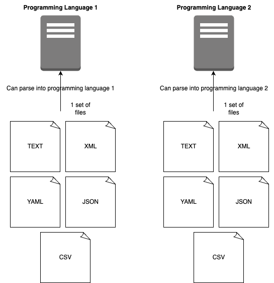

# 01a [Individual] Data parsing servers - Part I

**Type**: Individual

Create two sets of files in at least these formats: text, xml, yaml, json, csv. You decide the content (but avoid any personal data).

Create (server-side) scripts that can read and parse the files in 2 programming languages of your choice.

Data parsing is the act of reading data (in this case files) into a program. You have suceeded when you can print them out as a data structure in your programming language.

You are free to use libraries to help you parse the files into data types that make sense in the respective language.

# Python
https://github.com/Marcus-K-Thorsen/01a._Data_parsing_servers_part_1/blob/main/py-server-app/README.md

# JavaScript
https://github.com/Marcus-K-Thorsen/01a._Data_parsing_servers_part_1/blob/main/js-server-app/README.md